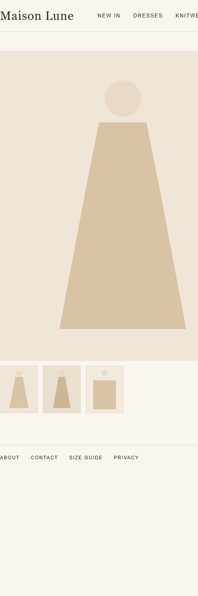
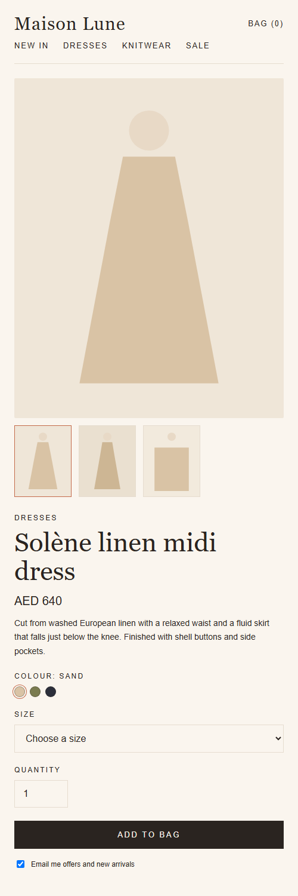
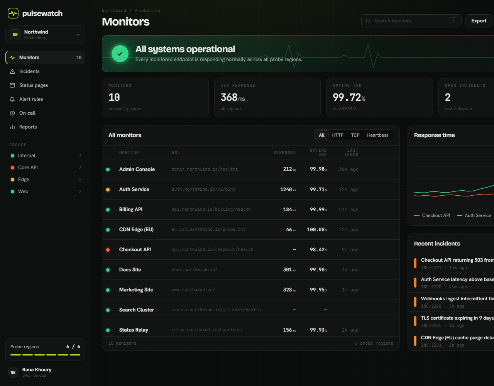
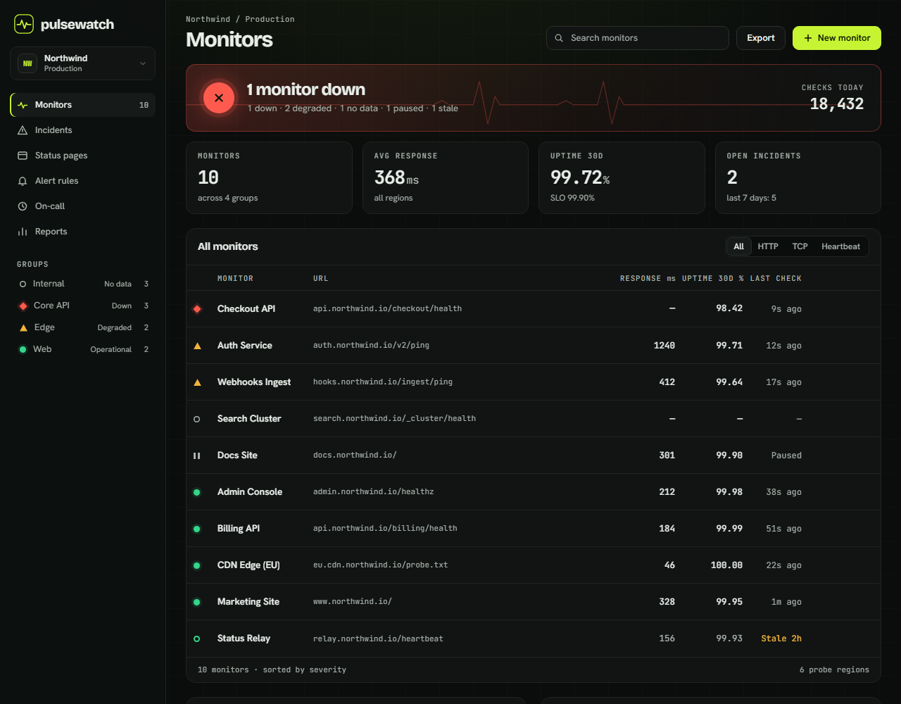
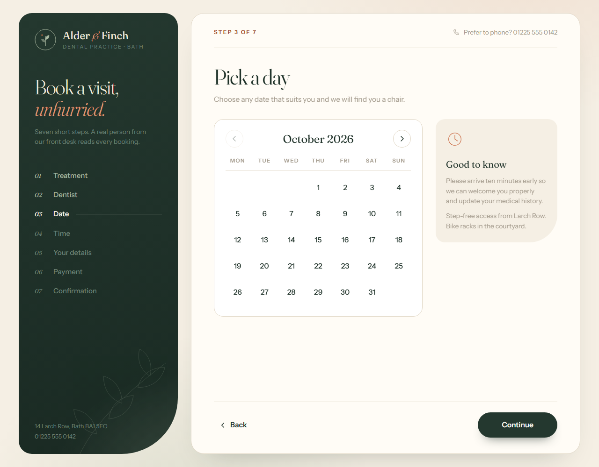
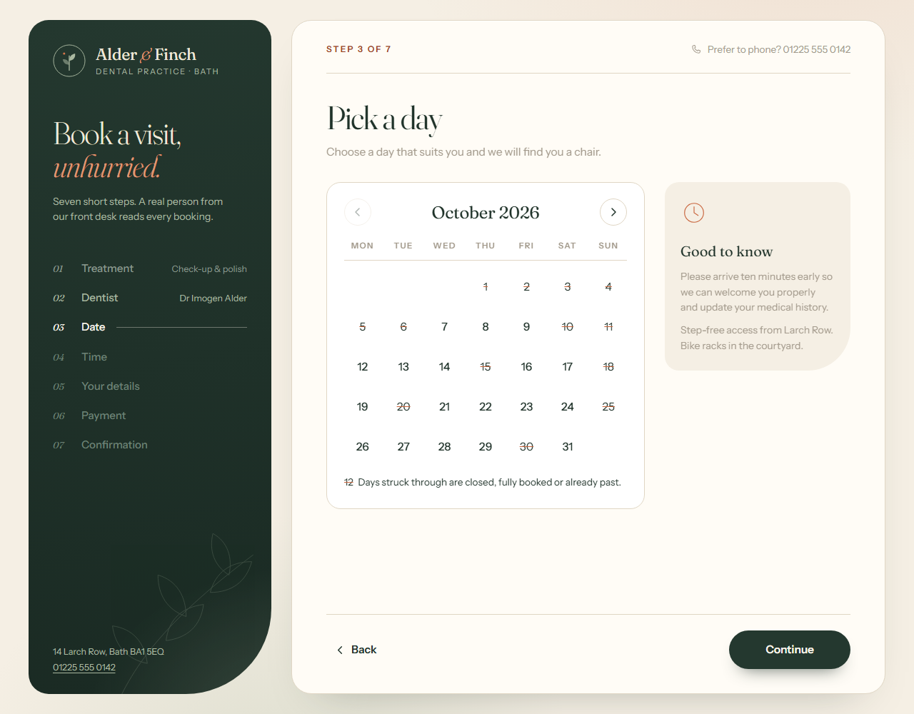
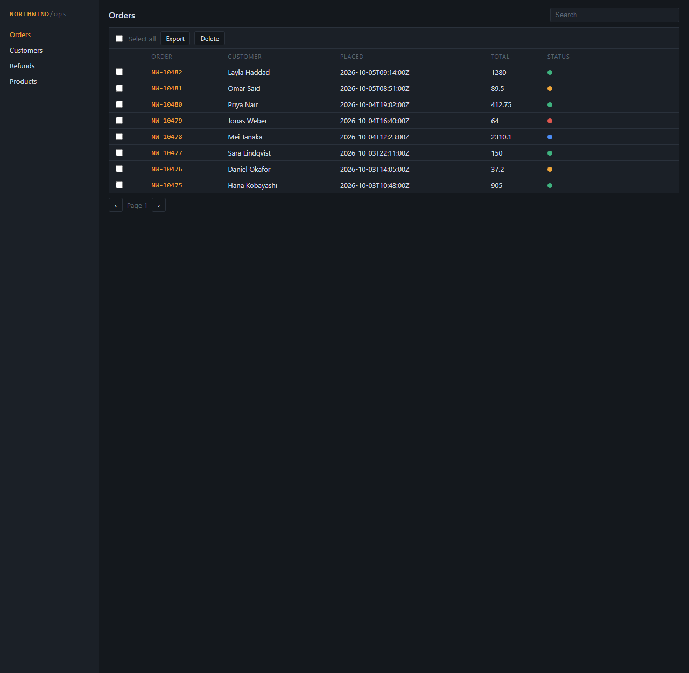
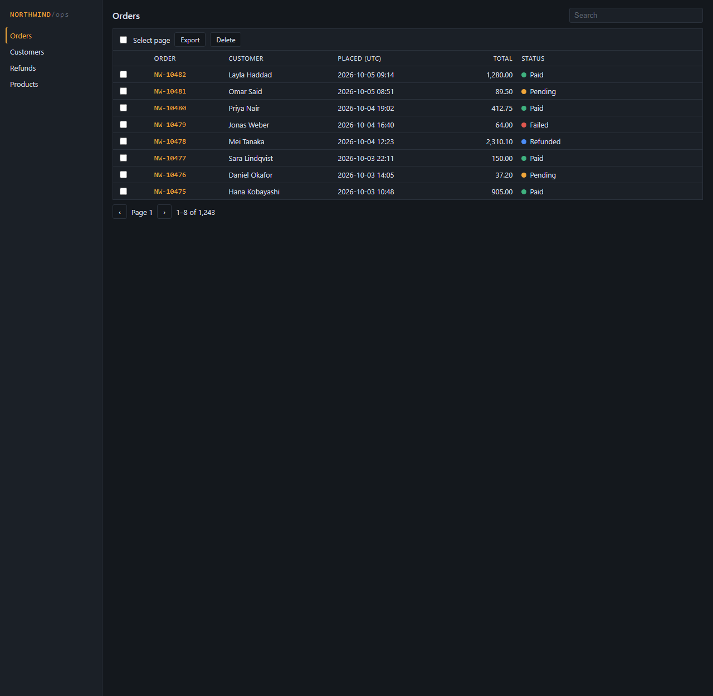
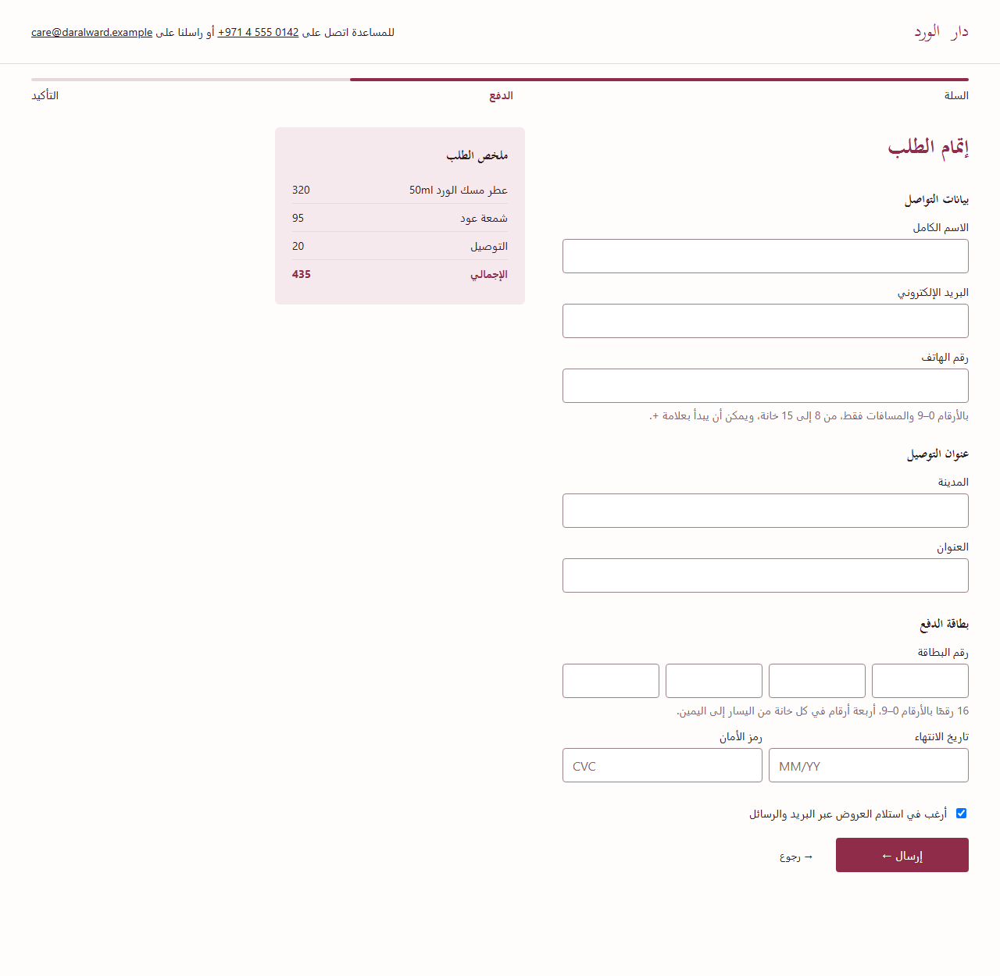
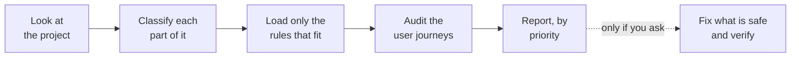

<h1 align="center">adaptive-fwm-ux-ui</h1>

<p align="center">
  <strong>A skill that teaches your AI coding agent to audit and fix the UX and UI of any website or app,<br>without breaking how it works or what it looks like.</strong>
</p>

<p align="center">
  
  
  
  
  
  
</p>

<p align="center">
  <a href="#quick-start">Quick start</a> ·
  <a href="#see-it-work">Examples</a> ·
  <a href="#what-you-can-ask">What you can ask</a> ·
  <a href="#your-site-is-a-salesperson">Selling</a> ·
  <a href="#what-it-will-never-do">Safety</a> ·
  <a href="#how-it-works">How it works</a> ·
  <a href="#questions">Questions</a>
</p>

---

## Why this exists

Most UX checklists apply the same rules to everything. But a good fashion store and a good server-monitoring dashboard have almost nothing in common. Advice that helps one will hurt the other.

So this skill **looks first, then judges**. It works out what each part of your product is for and who uses it, loads only the rules that fit, and reports what it finds with the evidence behind each point. If you ask it to fix things, it changes presentation only and leaves your logic, your data and your brand alone.

| You get | What that means |
|---|---|
| 🎯 **Advice that fits** | Your store, your customer account area and your staff admin are judged by different rules. |
| 📚 **Reasons, not opinions** | Every finding says which rule it rests on: an accessibility requirement, published research, or a judgment call. |
| 🔒 **Nothing broken** | Read-only by default. In fix mode it never touches pricing, checkout, logins, data or business logic. |
| 🎨 **Your brand, kept** | It works inside your existing colors, type and style. It has no house style of its own. |
| ✅ **Nothing invented** | No fake reviews, fake countdowns, fake prices or made-up statistics. Ever. |

## Quick start

**1. Install it** (one command):

```bash
git clone https://github.com/HamoodMMD/adaptive-fwm-ux-ui.git ~/.claude/skills/adaptive-fwm-ux-ui
```

Using Codex? Clone into `~/.agents/skills/adaptive-fwm-ux-ui` instead. [More install options](#installation).

**2. Open your project in your agent and ask in plain words:**

> Audit my website's UX. Don't change anything.

**3. Read the report.** When you are ready:

> Fix the safe issues.

That's all. There are no commands to learn.

## See it work

Each page below was built with flaws planted on purpose. One AI agent audited the page with this skill, without being told what was planted. A second agent applied the fixes. The screenshots are real, unedited captures.

### A phone product page that hid its own Buy button

| Before | After |
|---|---|
|  |  |

**Found 12 of 12 planted flaws.** The buy controls are reachable again, a fake "Only 2 left!" countdown is gone, colors have names, and text is readable. It left the pre-ticked marketing box for the owner to decide, because that changes what data is collected.

### A status page that said "All systems operational" during an outage

| Before | After |
|---|---|
|  |  |

**Found 12 of 12.** The banner now reports the real state, failing monitors are at the top, and old data is labelled as old. Alert thresholds were not touched.

<details>
<summary><strong>Three more examples: clinic booking, staff orders table, Arabic checkout</strong></summary>

<br>

**Clinic booking flow** — found 13 of 13. Unavailable days are marked before the patient picks one, earlier choices stay visible, and a fake "Only 1 slot left" badge is gone. Availability and deposit logic untouched.

| Before | After |
|---|---|
|  |  |

**Internal orders table** — found 10 of 10. Status words, aligned totals, readable times, specific delete confirmations. It kept the compact rows and dark theme, because staff tools should stay dense.

| Before | After |
|---|---|
|  |  |

**Arabic checkout** — found 12 of 12. Fixed a reversed phone number, a progress bar filling from the wrong side, and broken Arabic headings.

| Before | After |
|---|---|
|  |  |

</details>

In every example the business-logic files were untouched and the tests passed before and after.
**[Read the full write-ups: what was found, what was fixed, and what was deliberately left alone →](docs/examples/README.md)**

## What you can ask

| You want to… | Say something like… | Does it edit files? |
|---|---|---|
| Find problems | "Audit my site" · "Review this dashboard" · "What's wrong with this page?" | No |
| Find and fix | "Fix the UX issues" · "Improve this page" · "Apply the safe changes" | Yes, presentation only |
| Look at one part | "Audit only the checkout" · "Check the signup form" | Only if you ask |
| Skip a part | "Audit everything except the admin panel" | Only if you ask |
| Focus on one thing | "Do an accessibility pass" · "Check it on mobile" · "Check the Arabic layout" | Only if you ask |
| Check the details | "Are my font sizes and header size right?" | Only if you ask |
| Review a sales page | "Review my pricing page" · "Is my landing page clear?" | Only if you ask |
| Judge the site as a salesperson | "Would a visitor stay and buy, or walk out?" · "What is my site's selling strategy?" | Only if you ask |
| Plan before building | "Plan the UX for a booking flow before I build it" | No |

**The rule of thumb:** *audit, review, check* never change anything. *Fix, improve, implement, apply* do. If your request is unclear, it audits and offers you the list of fixes.

You can combine these: *"Audit only the checkout on mobile and fix what's safe."*

## Your site is a salesperson

A selling site does what a good salesperson does in a shop. A site that is confusing or hard to get around is a bad one, and visitors leave the way customers walk out. For any page whose job is to sell or win a lead, the skill checks six stages:

| Stage | A good salesperson… | A bad one… |
|---|---|---|
| **Greet** | Says hello and lets you look. The first screen says what this is and what you can do. | Blocks the door with pop-ups before you have seen anything. |
| **Guide** | Asks what you are looking for and points the way. | Makes you search the whole shop. |
| **Show** | Puts the product in your hands. | Talks about the company. |
| **Answer** | Hears your doubt and answers it there. | Changes the subject. |
| **Close** | Has the till open when you are ready. | Sends you to queue somewhere else. |
| **After** | Tells you what happens next. | Leaves you wondering if it worked. |

It runs a **walk-out test**: it goes through your page as a first-time visitor on a phone and writes down every moment a reasonable person could give up, and why (did not understand, could not find, had to wait, was interrupted, had to work, did not believe).

### Thirteen ways to sell

Good salespeople do not all sell the same way. Each strong site has a deliberate manner, and its whole interface carries it out. The skill works out which one your site is attempting, whether it suits what you sell, and whether your interface helps or gets in the way.

| Strategy | The idea | Seen on |
|---|---|---|
| Immersive storytelling | Make people want it before they think about price | Apple, Rivian, Tesla |
| Guided choice | Ask a few easy questions, then recommend | Warby Parker, Lemonade, Noom |
| Quiet catalog | The product sells itself; the interface gets out of the way | Allbirds, Glossier, Everlane |
| Authority by depth | Show who already relies on it; let readers go as deep as they need | Stripe, Plaid, Cloudflare |
| The site is the demo | The site is as fast and precise as the product | Linear, Vercel, Raycast |
| Try it now | Shorten the distance to first use | Canva, Notion, Grammarly |
| Proof first | Lead with other people's evidence | Thumbtack, Ridge, Casper |
| Offer first | Say the price first | Mint Mobile |
| The letter | Win the reader with an argument in a human voice | Basecamp, HEY |
| Build your own | Let the buyer assemble their version | Apple's buy pages, Rivian |
| Task first | Put the search or request form where the pitch would be | Booking.com, Airbnb, Uber, Wise |
| Portfolio and conversation | Show the work and make it easy to talk | Pentagram, IDEO, Toptal |
| Plain dealing | Say what you do, what it costs and how to get it | Most small and local business sites (not in the survey) |

These come from walking 66 real selling pages from top to bottom on phone and desktop. Three rules keep it honest:

- **Your strategy is yours.** The skill judges your site against its own manner and helps it execute. It may recommend a different strategy; it never switches yours.
- **Named sites are evidence, never templates.** It will not restyle your site to look like Apple. Ask it to "sell like Apple" and it tells you which strategy Apple uses, whether that suits your offer, which habits transfer, and what you would need to supply.
- **A strategy cannot be built from nothing.** Storytelling needs real imagery and proof-first needs real proof. If the material is missing, it tells you what to supply.

## What it will never do

These hold in every mode, whatever you ask for in passing.

**It will not change how your product works.** Unless you explicitly ask for functional work, it leaves alone: APIs, databases, routes, logins and permissions, pricing, tax, stock, cart and checkout, payments, bookings, alerts, analytics, AI prompts and integrations. If a real improvement needs one of those, it writes it up under *Functional recommendations — not implemented* and lets you decide.

**It will not redesign your brand.** Your logo, colors, fonts, spacing and style are treated as the brief. If your brand purple is too pale to read as small text, it stops using it for small text. It does not swap your purple.

**It will not invent anything to make a page look or sell better.** No price, plan, discount, "free" offer, deadline, stock count, testimonial, rating or statistic appears unless your project already states it. If your page would be stronger with a real testimonial or a starting price, it tells you what to supply and leaves the space empty.

**It will not use tricks.** No fake urgency, fake scarcity, hidden fees, pre-ticked boxes, or guilt-trip wording, even if it would lift a number.

**It will not commit or push** unless you tell it to.

## How it works



1. **Look.** It reads what you said, your docs, your code, your pages and your copy before asking you anything.
2. **Classify.** It splits the product into *surfaces* (groups of screens with the same users and goal) and describes each one: who uses it, why, on what device, how risky a mistake is, what language.
3. **Load.** It picks one main profile, up to two supporting ones, and the patterns for what is actually on screen.
4. **Audit.** It walks through what users are trying to do, then checks individual screens.
5. **Report.** Findings are ranked from **P0** (blocks people) to **P3** (polish), each with its evidence. It also lists what already works, so good parts are not redesigned.
6. **Fix, if asked.** Small groups of changes, tests run before and after, the full diff checked, and anything it could not verify is said plainly.

**Examples of what gets loaded:**

| Your product | Rules it uses |
|---|---|
| Fashion store | ecommerce + fashion + filters, forms, mobile |
| Agency or service website | service business + lead generation + forms, pricing, visual scale |
| Monitoring tool | SaaS app + monitoring + dashboards, charts, tables |
| AI workspace | SaaS app + AI product + forms, loading and error states |
| Staff admin panel | admin tools + tables, filters, forms |
| Booking marketplace | booking + marketplace + filters, forms |

<details>
<summary><strong>All 30 rule modules</strong></summary>

<br>

**Core (5)** — apply everywhere
`universal-ux` · `accessibility` · `performance` · `content-and-trust` · `brand-preservation`

**Profiles (14)** — chosen by what the surface is for
`ecommerce` · `fashion-apparel` · `sales-lead-generation` · `service-business` · `informational-content` · `b2b-marketing` · `saas-application` · `dashboard-analytics` · `monitoring-observability` · `admin-backoffice` · `ai-product` · `booking-reservation` · `marketplace-directory` · `high-stakes`

**Patterns (11)** — chosen by what is on the screen
`forms` · `navigation` · `tables` · `search-filter-sort` · `charts-data-viz` · `loading-empty-error-states` · `responsive-mobile` · `rtl-bilingual` · `visual-scale` · `pricing-and-persuasion` · `sales-journey`

Plus a catalog of thirteen selling strategies in `references/selling-strategies.md`.

Every module has the same shape: when to load it, objectives, principles, concrete checks, anti-patterns, exceptions, cautions for implementation, and sources.

</details>

### The details: sizes, and selling honestly

Two modules deal with the questions people ask most.

**`visual-scale`** covers font sizes, line length, header height, the first screen and button sizes. It keeps three kinds of number apart so you know how much weight each carries:

| Kind | Example |
|---|---|
| **Requirement** (can be failed) | Tap targets at least 24 by 24 pixels; text resizable to 200% |
| **Published guidance** | Body text at least 16px; 50 to 75 characters per line |
| **Observed practice** (measured on 28 well-known commercial sites) | Main headline around 64px on desktop and 38px on phones; header about 72px and 64px |

It will not resize your type just to match what is typical.

**`pricing-and-persuasion`** covers the well-known selling effects: framing, anchoring, the "rule of three", the power of "free", loss aversion, urgency, per-day pricing, defaults and the paradox of choice. For each one it says how to use it honestly, and how well the research really supports it (several famous effects are weaker than their reputation). Changes are sorted into three levels:

| It may do | It recommends to you | It never does |
|---|---|---|
| Reorder and align your existing plans | Add or rename a plan | Invent a price, plan or discount |
| Make the real price and billing terms prominent | Mark a plan "most popular" | Write "free" where you don't offer it |
| Move your real guarantee next to the button | Show a per-day price | Add countdowns, "only 2 left", or reviews |

It also never promises that a change will increase sales.

## Installation

A skill is just a folder. Put it where your agent looks for skills and keep the folder name `adaptive-fwm-ux-ui`.

| Agent | For all your projects | For one project only |
|---|---|---|
| **Claude Code** | `~/.claude/skills/adaptive-fwm-ux-ui/` | `.claude/skills/adaptive-fwm-ux-ui/` |
| **Codex** | `~/.agents/skills/adaptive-fwm-ux-ui/` | `.agents/skills/adaptive-fwm-ux-ui/` |
| **Other Agent Skills tools** | See your tool's documentation for its skills folder | |

macOS and Linux:

```bash
git clone https://github.com/HamoodMMD/adaptive-fwm-ux-ui.git ~/.claude/skills/adaptive-fwm-ux-ui
```

Windows (PowerShell):

```powershell
git clone https://github.com/HamoodMMD/adaptive-fwm-ux-ui.git "$HOME\.claude\skills\adaptive-fwm-ux-ui"
```

To update later, run `git pull` inside that folder.

It has no dependencies and needs no network access to run. Only `SKILL.md`, `references/` and `assets/` are used at run time.

## Questions

<details>
<summary><strong>Will it change my code if I just ask it to "check" my site?</strong></summary>

No. *Audit, review* and *check* are read-only. It does not leave helper files in your project either.
</details>

<details>
<summary><strong>Is this a set of guidelines, or does it do the fixing?</strong></summary>

Both. By default it audits and reports. When you ask it to fix, it makes the changes itself, within the safety limits above, and gives you a report of exactly what changed.
</details>

<details>
<summary><strong>How do I try it without risk?</strong></summary>

Ask for an audit only. Or ask for fixes on a new git branch and review the diff before merging. It never commits or pushes on its own.
</details>

<details>
<summary><strong>Will it interfere when I say "audit" about something else, like security or SEO?</strong></summary>

It is meant for UX, UI, usability and accessibility requests. A security audit or an SEO audit is a different job, and the skill does not claim it.
</details>

<details>
<summary><strong>Can I use it with a design skill that builds new pages?</strong></summary>

Yes. They do different jobs: a design skill creates a new look, and this one checks and repairs an existing interface without restyling it. A common flow is to build with one and audit with the other.
</details>

<details>
<summary><strong>Does it work for Arabic and other right-to-left sites?</strong></summary>

Yes. There is a dedicated module for RTL and bilingual layouts. It checks structure and rendering; it does not judge the quality of wording in languages the agent cannot verify.
</details>

<details>
<summary><strong>Can it make my page sell more?</strong></summary>

It can make your real offer clearer and easier to act on, which is usually what a sales page is missing. It will not invent offers, and it will not promise a conversion increase, because no honest tool can.
</details>

## Limitations

- **It predicts; it does not watch real users.** Findings rest on published research and standards, not on testing with your customers.
- **What it can verify depends on what it can see.** From code alone it cannot confirm real colors, layouts or keyboard order, and it marks those findings as *inferred*. A running app or screenshots give better results.
- **It is not a compliance certificate or legal advice.** It finds accessibility and consumer-protection problems; it cannot prove there are none.
- **It is not a redesign or rebrand tool,** and not a performance-engineering tool.
- **Some guidance is judgment.** Where strong research is thin, the modules say so. See "Known gaps" in [`references/research-sources.md`](references/research-sources.md).
- **The measured site figures will date.** They were taken in October 2026, by script, one visit per page.
- **The thirteen selling strategies are an interpretation.** They group what real sites were observed doing, supported by research on each technique. No study validates the grouping itself, the sites walked were large brands, and naming a site's strategy is a judgment the skill labels as one.
- **Testing so far** is blind AI-agent runs on routing scenarios and demo pages. It has not been tested with real users, on physical devices or with screen readers.

## Under the hood

```text
adaptive-fwm-ux-ui/
├── SKILL.md                      the router: workflow, loading tables, rules that always hold
├── references/
│   ├── classification.md         how surfaces are classified
│   ├── conflict-resolution.md    what wins when rules disagree
│   ├── implementation-safety.md  what may be edited, and the procedure
│   ├── selling-strategies.md     thirteen ways a site can sell, when each fits, how each fails
│   ├── research-sources.md       all 183 sources, with how each was checked
│   ├── core/                     5 modules for every surface
│   ├── profiles/                 14 modules chosen by classification
│   └── patterns/                 11 modules chosen by what is on screen
├── assets/                       report templates
└── docs/examples/                before and after screenshots with write-ups
```

Sources include WCAG 2.2, Nielsen Norman Group, Baymard Institute, GOV.UK and US government design systems, Google and Apple platform guidance, peer-reviewed studies on decision-making, and consumer-protection rules. Each entry records whether the page was read in full or confirmed by summary only.

See the [changelog](CHANGELOG.md) for what changed in each version.

## License

No license has been chosen yet. Until one is added, default copyright applies and others may not reuse this work.
