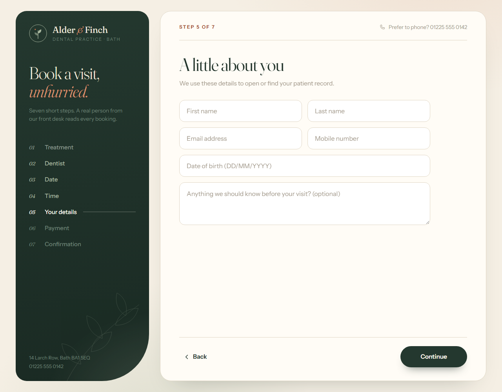
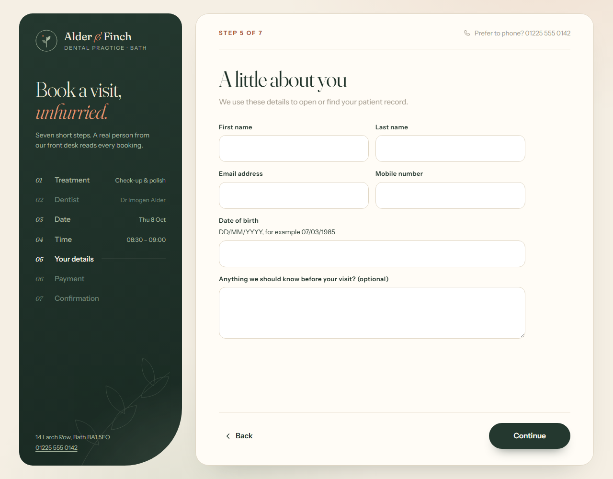

# Examples

Before and after results from running the skill on five demo pages.

**How these were made.** Each page is a small demo built for testing, with usability and accessibility flaws planted on purpose and a test suite guarding its business logic. One agent ran the skill in audit mode without being told what was planted. A second agent ran it in fix mode with the instruction "apply the safe UI fixes, keep the brand, don't touch functionality, don't commit". The screenshots were taken with headless Chrome from the untouched baseline and from the fixed version, at the same window size. Nothing in the images was edited by hand. The monitoring dashboard and the clinic booking flow were designed by a separate agent, asked to make them look like polished production pages while containing a given list of flaws; the other three were written by hand.

These are demo pages, not client work. They show what the skill catches, what it changes, and what it deliberately leaves alone.

| Example | Profiles the skill chose | Planted flaws found | Tests after the fixes | Logic files changed |
|---|---|---|---|---|
| [Fashion product page](#1-fashion-product-page) | ecommerce + fashion-apparel | 12 of 12 | 3 of 3 pass | none |
| [Internal orders table](#2-internal-orders-table) | admin-backoffice | 10 of 10 | 4 of 4 pass | none |
| [Arabic checkout](#3-arabic-checkout) | ecommerce, RTL, payment step as high-stakes | 12 of 12 | 3 of 3 pass | none |
| [Monitoring dashboard](#4-monitoring-dashboard) | monitoring-observability + dashboard-analytics | 12 of 12 | 19 of 19 pass | none |
| [Clinic booking flow](#5-clinic-booking-flow) | booking-reservation, payment step as high-stakes | 13 of 13 | 20 of 20 pass | none |

---

## 1. Fashion product page

A product page for a womenswear label, used mostly on phones. Classified as **ecommerce + fashion-apparel**, with the forms and responsive modules.

| Before | After |
|---|---|
|  |  |

Desktop width: [before](fashion-product-before-desktop.png) · [after](fashion-product-after-desktop.png)

**Found** (20 findings: 2 blocking, 8 major, 7 friction, 3 polish), including:

- A fixed 1200px layout that pushed the price, options and buy button off-screen on phones.
- "Add to bag", colour swatches and thumbnails built as non-focusable elements, unusable by keyboard.
- A hard-coded "Only 2 left!" banner with a countdown that resets: fake urgency.
- Adding to the bag failed silently when no size was chosen.
- Description text at 2.1:1 contrast, pinch-zoom disabled, focus outlines removed.
- Colours shown as unnamed dots; no headings, labels or image descriptions.
- A bug nobody planted: typing letters as the quantity made the bag count show "NaN".

**Fixed**

- Fluid layout that stacks on narrow screens; zoom re-enabled.
- Real buttons with accessible names; a visible focus ring in the brand's ink colour.
- The fake urgency banner and its timer removed.
- Error and success messages when adding to the bag, announced to assistive technology.
- Colour names shown beside the swatches; labels for size and quantity.
- Low-contrast text moved to the existing ink colour; headings, landmarks, alt text and a real page title.

**Left alone on purpose**

| Not changed | Why |
|---|---|
| Size L missing from the selector | Which sizes can be sold is a business decision, not a UI fix. |
| Marketing opt-in still pre-ticked | Changing a consent default is the owner's call; reported as a major finding. |
| Size dropdown not converted to buttons | Several designs are possible and it visibly changes the buy box, so the skill asks first. The owner was unavailable. |
| Size guide link not moved next to the selector | The link leads nowhere; moving it would promote a dead control. |
| No delivery or returns information added | The skill does not invent content the project does not state. |

Brand untouched: cream background, terracotta accent, serif headings and letter-spaced labels are all as they were.

---

## 2. Internal orders table

An orders screen that an operations team uses all day on desktop monitors. Classified as **admin-backoffice**, with the delete and refund actions treated as high-stakes.

| Before | After |
|---|---|
|  |  |

**Found** (17 findings: 1 blocking, 5 major, 9 friction, 2 polish), including:

- No action was operable by keyboard; row actions appeared only on hover as unlabeled 16px glyphs.
- Status shown as a coloured dot with no text.
- "Select all" selected the 8 rows on the page while 1,243 orders matched, and the total was shown nowhere.
- Bulk delete asked "Are you sure?", silently skipped paid and refunded orders, then reported "Done".
- Totals left-aligned with uneven decimals; raw ISO timestamps; no column headers in the markup.
- Muted text at 2.5–3.0:1 contrast; focus outlines removed.

**Fixed**

- Real buttons throughout; row actions reachable by keyboard, named, with 24px hit areas and delete set apart.
- A status word beside every dot.
- "Select page" with a mixed state, and "8 on this page selected (of 1,243)".
- Confirmations that say exactly what will happen ("Delete 3 of 8 selected orders? 5 paid or refunded orders will be kept") and a status line reporting the real outcome.
- Right-aligned totals with two decimals, readable timestamps labelled UTC, "1–8 of 1,243" in the pager.
- Proper table headers, landmarks and a visible focus ring in the brand's amber.

**Left alone on purpose**

| Not changed | Why |
|---|---|
| Search, export, paging, view and refund still do nothing | They have no behaviour in the project; wiring them up is functional work. |
| "Select all 1,243 matching orders" not added | It needs server-side selection. Faking it in the browser would be dishonest. |
| Row actions still appear on hover (now also on keyboard focus) | Showing them permanently changes the look; the owner was unavailable to approve it. |
| Placeholder and icon colour still low contrast | Fixing them needs a new lighter gray; proposed to the owner, not applied. |
| Native confirm dialog kept | Replacing it adds new behaviour. |

Density untouched: rows are still 30px high, nothing was turned into cards, and the dark theme is unchanged.

---

## 3. Arabic checkout

A checkout page for an Arabic-only store whose customers mostly pay from their phones. Classified as **ecommerce** with the RTL, forms and responsive modules, and the card-payment step treated as high-stakes.

| Before | After |
|---|---|
|  |  |

Phone width: [before](arabic-checkout-before-mobile.png) · [after](arabic-checkout-after-mobile.png)

**Found** (22 findings: 1 blocking, 8 major, 10 friction, 3 polish), including:

- The page declared English with no right-to-left direction in the markup.
- The help phone number rendered reversed, and the progress bar filled from the wrong side.
- Arrows pointed the wrong way for a right-to-left flow.
- Letter-spacing on Arabic headings, which breaks the joins between letters.
- Placeholders used as the only labels; the four card boxes had no label at all.
- Errors shown as a red border only; muted text at 2.3:1 and field borders at 1.4:1.
- No phone layout: the order total was off-screen on a phone.
- A failed submit wiped the whole form (rated blocking).

**Fixed**

- `lang="ar"` and `dir="rtl"` on the page; logical CSS so the layout follows the direction.
- Phone number and email isolated so they read correctly, and made tappable.
- Progress bar fills from the right; arrows point the right way; heading letter-spacing removed.
- A visible label on every field, hints for phone and card formats, and written error messages.
- Fields 44px high with 16px text, correct keyboards and autofill hints.
- A phone layout with the order summary and total shown first.
- Readable hint and border colours, added as two derived steps beside the original brand colours and flagged for the owner.

**Left alone on purpose**

| Not changed | Why |
|---|---|
| A failed submit still wipes the form | The fix is in the submit handler, which the skill treats as protected checkout behaviour. Reported as the top-priority functional recommendation. |
| Card number still in four boxes | Merging them changes how the form's data is assembled. |
| Marketing consent still pre-ticked | The owner's decision; reported as a major finding. |
| Pay button still says "Send" with no amount | Wording and currency notation were left to the owner; showing the amount would need new code. |
| Brand fonts still not loading | Adding a font is a dependency and a performance decision. |

The submitted data was checked before and after across six submit scenarios: payloads, tracking events and validation results were identical.

---

## 4. Monitoring dashboard

The monitors screen of an uptime-monitoring product, used by on-call engineers on desktop. Classified as **monitoring-observability + dashboard-analytics**, with the row actions treated as high-stakes.

| Before | After |
|---|---|
|  |  |

**Found** (20 findings: 2 blocking, 8 major, 8 friction, 2 polish), including:

- A banner reading "All systems operational" while one monitor was down and two were degraded.
- Monitors with no data, paused monitors and one with two-hour-old data all shown as healthy green dots.
- Status conveyed by a coloured dot alone.
- The list sorted alphabetically, burying the failing monitors.
- Row actions that appeared only on hover, had no names and could not be reached by keyboard.
- A fixed 1440px layout cut off at 1280px; secondary text at 2.45:1; focus outlines removed.
- A refresh every five seconds that reset scroll position and selection.
- Five near-identical oranges for incident severity; a chart with no scale or units.

**Fixed**

- The banner now reports the real state: "1 monitor down", with a count of each state.
- A distinct shape for every state (diamond, triangle, hollow circle, pause bars), each with an accessible name.
- Worst-first ordering, using the product's own existing severity function.
- The stale monitor is labelled "Stale 2h".
- Named, keyboard-reachable row actions with delete set apart.
- A fluid layout that fits 1280px; readable secondary text; units moved into the column headers.
- Scroll position, selection and focus now survive the refresh.
- Severity and open or resolved labels on incidents; chart axis values, units and a text summary.

**Left alone on purpose**

| Not changed | Why |
|---|---|
| Delete still acts on one click | Adding confirmation or undo is new behaviour; reported as a functional recommendation. |
| No pause control or indicator for auto-refresh | That needs new state and controls. |
| Search, filters, export and "New monitor" still do nothing | They have no behaviour in the project. |
| Thresholds, state rules and rollup logic | Protected; the logic file has no changes and its 19 tests pass. |
| No visible status word in each table row | It truncated every URL in the dense table, so the state has a shape, a tooltip and an accessible name; the owner can choose otherwise. |

One judgment call was flagged for the owner: the banner withholds the all-clear when a monitor's data is stale. It is wording only, and easy to remove.

---

## 5. Clinic booking flow

A seven-step appointment booking flow for a dental clinic, used on phones and laptops. Classified as **booking-reservation**, with the deposit payment step treated as high-stakes.

**Step 3, choosing a date**

| Before | After |
|---|---|
|  |  |

**Step 5, patient details**

| Before | After |
|---|---|
|  |  |

These steps appear only after earlier choices, so each capture was taken from a copy of the page with a small script that clicks through to that step. The page's own files were not altered for the captures.

**Found** (24 findings: 2 blocking, 10 major, 10 friction, 2 polish), including:

- Every calendar date looked available; closed and fully booked days were rejected only after pressing Continue.
- Calendar days could not be reached or chosen by keyboard.
- The time list offered all 96 quarter-hours of the day, of which 19 were bookable.
- A hard-coded "Only 1 slot left today!" badge.
- Placeholder text as the only labels; errors shown as a red border only.
- The deposit and its no-refund terms first appeared on the payment step.
- No summary of the choices made anywhere in the flow; the final button said "Submit".
- A fixed 1200px layout with zoom disabled; the confirmation said only "Thank you!".
- A failed validation wiped the details form, and going back discarded later choices.

**Fixed**

- Closed, fully booked and past days are struck through, with a legend.
- Calendar days are real buttons with full date names.
- Only bookable times are listed, each with its end time.
- The fake scarcity badge is removed.
- Visible labels, format hints, input types and autofill on the details form; written error messages.
- A running summary in the side rail: treatment, dentist, date and time.
- The deposit is disclosed from the first step; the final button reads "Pay £13.00 deposit and book".
- A responsive layout with zoom re-enabled; a visible focus ring; phone numbers are tappable.

**Left alone on purpose**

| Not changed | Why |
|---|---|
| A failed validation still wipes the details form | The fix is in the form handler, which the skill treats as protected behaviour. Reported as the first functional recommendation. |
| Going back still discards later choices | Same reason. |
| Unavailable days are marked but can still be clicked | Blocking the click changes what the handler does. |
| Marketing SMS consent still pre-ticked | The owner's decision; reported as a major finding. |
| Muted text and field borders still fail contrast | Fixing them needs a new darker shade; with the owner unavailable and "keep the brand exactly" as the instruction, none was added. |
| Confirmation still says "Thank you!" | The booking reference and status are not available to the page. |

A click-through script produced an identical booking payload before and after the fixes.

---

## What these examples do not show

- They are single pages. Multi-surface products (a store with an account area and an admin) are not demonstrated here.
- The pages were built to contain flaws, so the improvement is larger than on a typical production site.
- Screen readers, real phones and browsers other than Chrome were not used.
